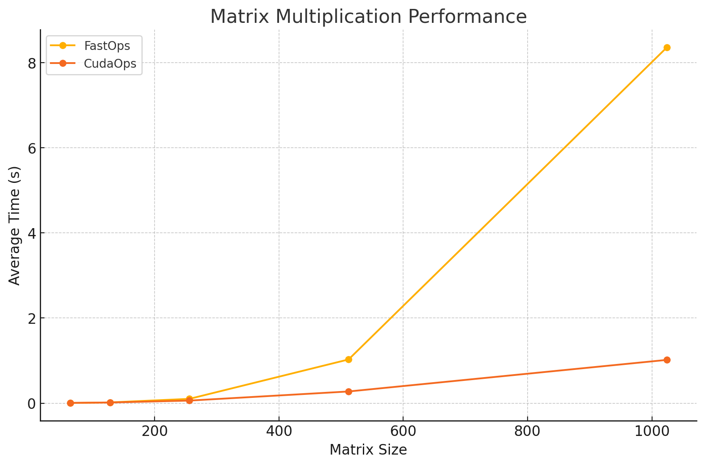

# MiniTorch Module 3


* Docs: https://minitorch.github.io/

* Overview: https://minitorch.github.io/module3.html


You will need to modify `tensor_functions.py` slightly in this assignment.

* Tests:

```
python run_tests.py
```

For Task 3.1 debugging:

```
python project/parallel_check.py
```

* Note:

Several of the tests for this assignment will only run if you are on a GPU machine and will not
run on github's test infrastructure. Please follow the instructions to setup up a colab machine
to run these tests.

This assignment requires the following files from the previous assignments. You can get these by running

```bash
python sync_previous_module.py previous-module-dir current-module-dir
```

The files that will be synced are:

        minitorch/tensor_data.py minitorch/tensor_functions.py minitorch/tensor_ops.py minitorch/operators.py minitorch/scalar.py minitorch/scalar_functions.py minitorch/module.py minitorch/autodiff.py minitorch/module.py project/run_manual.py project/run_scalar.py project/run_tensor.py minitorch/operators.py minitorch/module.py minitorch/autodiff.py minitorch/tensor.py minitorch/datasets.py minitorch/testing.py minitorch/optim.py


Command to run before commit for style check:
```
pre-commit run --all
```

Run marked test:
```
pytest -m task1_1
```

## Task 3.4: CUDA Matrix Multiplication
Cuda matrix multiplication leads to speed-ups on large matrix operations compared with naive operations.

Timing summary
- Size: 64
    fast: 0.00352
    gpu: 0.00676
- Size: 128
    fast: 0.01732
    gpu: 0.01534
- Size: 256
    fast: 0.10131
    gpu: 0.06049
- Size: 512
    fast: 1.02714
    gpu: 0.27462
- Size: 1024
    fast: 8.35957
    gpu: 1.01676

Plot of performance:




## Task 3.5: Training

### Small Model Result
- Hidden Layers = 100
- Learning Rate = 0.05

### Simple Dataset
- Backend = GPU
- Epoch = 490
- Time per epoch = 1.767seconds
- Training log:
```
Epoch  0  loss  3.4642383960351144 correct 46
Epoch  10  loss  2.3278845833380557 correct 49
Epoch  20  loss  0.4651712766371487 correct 50
Epoch  30  loss  0.7545256295023387 correct 49
Epoch  40  loss  0.38729918502821464 correct 49
Epoch  50  loss  0.7292287505254642 correct 50
Epoch  60  loss  0.579246397436999 correct 50
Epoch  70  loss  0.02728924092232261 correct 50
Epoch  80  loss  0.4554630169497637 correct 50
Epoch  90  loss  0.1757181824203757 correct 50
Epoch  100  loss  0.23096190756102103 correct 50
Epoch  110  loss  0.45525324260777 correct 50
Epoch  120  loss  0.028604872999878114 correct 50
Epoch  130  loss  0.29924534374413075 correct 50
Epoch  140  loss  0.3000448448070087 correct 50
Epoch  150  loss  0.6367819988735982 correct 50
Epoch  160  loss  0.0323421870681993 correct 50
Epoch  170  loss  0.3323041901899031 correct 50
Epoch  180  loss  0.06553964594866286 correct 50
Epoch  190  loss  0.09920575219289703 correct 50
Epoch  200  loss  0.09259755941917995 correct 50
Epoch  210  loss  0.3591862976027924 correct 50
Epoch  220  loss  0.242410645221595 correct 50
Epoch  230  loss  0.21316135926988092 correct 50
Epoch  240  loss  0.05983817032748592 correct 50
Epoch  250  loss  0.34602161595952485 correct 50
Epoch  260  loss  0.010057568112297743 correct 50
Epoch  270  loss  0.30427070228470904 correct 50
Epoch  280  loss  0.05136626707554102 correct 50
Epoch  290  loss  0.03269814909039719 correct 50
Epoch  300  loss  0.1392701476622757 correct 50
Epoch  310  loss  0.04531973452194237 correct 50
Epoch  320  loss  0.15319627166003436 correct 50
Epoch  330  loss  0.19953589436601724 correct 50
Epoch  340  loss  0.012127316686109255 correct 50
Epoch  350  loss  0.1588833082192919 correct 50
Epoch  360  loss  0.24189919643330257 correct 50
Epoch  370  loss  0.006061930806990839 correct 50
Epoch  380  loss  0.0006895196378483121 correct 50
Epoch  390  loss  0.14381046749115645 correct 50
Epoch  400  loss  0.17012442626884305 correct 50
Epoch  410  loss  0.03933693990172919 correct 50
Epoch  420  loss  0.013895165671072194 correct 50
Epoch  430  loss  0.09369922507852367 correct 50
Epoch  440  loss  0.22890352490653695 correct 50
Epoch  450  loss  0.05303193768552365 correct 50
Epoch  460  loss  9.881678287902721e-06 correct 50
Epoch  470  loss  0.042230740574841476 correct 50
Epoch  480  loss  0.0908291022392584 correct 50
Epoch  490  loss  0.005245470308977125 correct 50

real	14m25.682s
user	14m15.082s
sys	0m5.895s
```


- Backend = CPU
- Epoch = 490
- Time per epoch = 0.273 seconds
- Training log:
```
Epoch  0  loss  4.588612050250033 correct 42
Epoch  10  loss  1.2022648784346504 correct 47
Epoch  20  loss  0.9079241803892858 correct 48
Epoch  30  loss  0.21845585842280546 correct 49
Epoch  40  loss  1.367006503709087 correct 49
Epoch  50  loss  0.20761335073667767 correct 50
Epoch  60  loss  1.100613824097555 correct 50
Epoch  70  loss  0.049902051070969324 correct 49
Epoch  80  loss  0.4619550272819754 correct 48
Epoch  90  loss  0.7312306540784765 correct 50
Epoch  100  loss  0.8783970672051982 correct 50
Epoch  110  loss  2.2679069088176105 correct 49
Epoch  120  loss  0.44788549371121056 correct 50
Epoch  130  loss  0.00629042433619755 correct 50
Epoch  140  loss  0.22037182186398416 correct 48
Epoch  150  loss  1.0585895695998766 correct 49
Epoch  160  loss  0.3065482275013245 correct 50
Epoch  170  loss  0.4920822711430201 correct 50
Epoch  180  loss  0.66674893574611 correct 50
Epoch  190  loss  0.017073710148426444 correct 50
Epoch  200  loss  1.1512315554665518 correct 48
Epoch  210  loss  0.7147732955275342 correct 50
Epoch  220  loss  0.8218124131238607 correct 50
Epoch  230  loss  0.010236364502253199 correct 50
Epoch  240  loss  0.10091602717583634 correct 48
Epoch  250  loss  0.1937390797478568 correct 50
Epoch  260  loss  1.0054196522132968 correct 50
Epoch  270  loss  0.6712856504203221 correct 50
Epoch  280  loss  0.670131258273504 correct 50
Epoch  290  loss  0.029719939603099398 correct 50
Epoch  300  loss  0.5374376384109786 correct 50
Epoch  310  loss  0.21189029161815012 correct 50
Epoch  320  loss  0.13462629864902464 correct 49
Epoch  330  loss  0.5900707543553899 correct 50
Epoch  340  loss  0.4580970293129518 correct 50
Epoch  350  loss  0.36757134444490186 correct 50
Epoch  360  loss  0.7221716295336493 correct 50
Epoch  370  loss  0.5589400488672137 correct 50
Epoch  380  loss  0.0008243347709218419 correct 49
Epoch  390  loss  0.0004922104881670765 correct 50
Epoch  400  loss  0.0028787098933120087 correct 50
Epoch  410  loss  0.40896988075121604 correct 50
Epoch  420  loss  1.4001703145313655 correct 48
Epoch  430  loss  1.0261531615662913 correct 50
Epoch  440  loss  0.40342219251781697 correct 50
Epoch  450  loss  0.027018403850368827 correct 50
Epoch  460  loss  7.209171477402004e-05 correct 50
Epoch  470  loss  0.19655209188889816 correct 50
Epoch  480  loss  0.09145736235482038 correct 50
Epoch  490  loss  0.0007941790130494538 correct 50

real	2m13.905s
user	2m24.375s
sys	0m28.369s
```


### Split Dataset
- Backend = GPU
- Epoch = 490
- Time per epoch = 1.718 seconds
- Training log:
```
Epoch  0  loss  6.4923732220058765 correct 35
Epoch  10  loss  6.833289866257934 correct 35
Epoch  20  loss  4.551905340255043 correct 40
Epoch  30  loss  4.464068605774136 correct 42
Epoch  40  loss  4.6481584437624806 correct 45
Epoch  50  loss  5.445229862445415 correct 46
Epoch  60  loss  2.9948832239563945 correct 45
Epoch  70  loss  1.7107878357656157 correct 45
Epoch  80  loss  2.334736922224883 correct 48
Epoch  90  loss  1.5537233306902436 correct 48
Epoch  100  loss  3.264140504771218 correct 44
Epoch  110  loss  1.6189889035510612 correct 48
Epoch  120  loss  1.8603073204677638 correct 48
Epoch  130  loss  2.388516165517773 correct 49
Epoch  140  loss  1.0379393496685503 correct 49
Epoch  150  loss  1.6614815118345843 correct 48
Epoch  160  loss  1.7764041193835758 correct 48
Epoch  170  loss  0.6931186248193987 correct 48
Epoch  180  loss  2.146838038308416 correct 49
Epoch  190  loss  1.3302512760277645 correct 49
Epoch  200  loss  0.7911557370333618 correct 45
Epoch  210  loss  0.5033239413433486 correct 49
Epoch  220  loss  1.5566061253103756 correct 48
Epoch  230  loss  1.278374385807387 correct 49
Epoch  240  loss  1.5135514046331537 correct 48
Epoch  250  loss  1.5499531639643842 correct 50
Epoch  260  loss  0.6501698414641939 correct 49
Epoch  270  loss  0.48870824186011885 correct 48
Epoch  280  loss  0.2946488917901418 correct 50
Epoch  290  loss  0.22807708129995932 correct 49
Epoch  300  loss  1.752739454759899 correct 44
Epoch  310  loss  0.7207169013350367 correct 50
Epoch  320  loss  1.0779026808646275 correct 49
Epoch  330  loss  0.8950473379325112 correct 48
Epoch  340  loss  0.6962720973097427 correct 49
Epoch  350  loss  0.21309185712884107 correct 48
Epoch  360  loss  0.365457808513853 correct 50
Epoch  370  loss  0.5876864668827544 correct 48
Epoch  380  loss  2.9878930751268014 correct 48
Epoch  390  loss  0.45287246958731375 correct 49
Epoch  400  loss  0.7757047664479783 correct 50
Epoch  410  loss  1.0824509958551283 correct 48
Epoch  420  loss  0.30596346439142375 correct 50
Epoch  430  loss  0.9161634876550329 correct 49
Epoch  440  loss  2.3209857654754944 correct 46
Epoch  450  loss  0.6809610536774144 correct 48
Epoch  460  loss  0.12695130194178633 correct 48
Epoch  470  loss  0.6797640399646854 correct 50
Epoch  480  loss  0.3143940320005277 correct 48
Epoch  490  loss  0.8152517616701986 correct 50

real	14m1.765s
user	13m51.879s
sys	0m5.488s
```

- Backend = CPU
- Epoch = 490
- Time per epoch = 0.279seconds
- Training log:
```
Epoch  0  loss  7.141114869327801 correct 37
Epoch  10  loss  5.597592684282591 correct 37
Epoch  20  loss  6.388462981319186 correct 41
Epoch  30  loss  3.5688898717489583 correct 44
Epoch  40  loss  3.289370068721539 correct 46
Epoch  50  loss  3.4420348771320652 correct 46
Epoch  60  loss  2.810794866655522 correct 48
Epoch  70  loss  2.0894252529069592 correct 48
Epoch  80  loss  1.7878777530440875 correct 48
Epoch  90  loss  2.9266715034197532 correct 48
Epoch  100  loss  1.6233033894084368 correct 48
Epoch  110  loss  1.6744252732029645 correct 48
Epoch  120  loss  1.4698821181259152 correct 49
Epoch  130  loss  2.413522290399298 correct 48
Epoch  140  loss  1.4646796054277378 correct 49
Epoch  150  loss  1.8043429607028116 correct 49
Epoch  160  loss  1.156996056948217 correct 48
Epoch  170  loss  1.3974212719633912 correct 47
Epoch  180  loss  1.3715573789293312 correct 47
Epoch  190  loss  0.28060636288011925 correct 50
Epoch  200  loss  0.8429379100853537 correct 49
Epoch  210  loss  1.6921990053738645 correct 50
Epoch  220  loss  1.3626321989325634 correct 48
Epoch  230  loss  1.486039008221202 correct 50
Epoch  240  loss  1.766724512898925 correct 49
Epoch  250  loss  0.2603624514209057 correct 47
Epoch  260  loss  1.2686674731305774 correct 49
Epoch  270  loss  0.9349104922642869 correct 48
Epoch  280  loss  1.0920557093433039 correct 49
Epoch  290  loss  1.9707406238706344 correct 49
Epoch  300  loss  0.43756449636899536 correct 49
Epoch  310  loss  1.238043136190053 correct 50
Epoch  320  loss  0.6530268758344528 correct 50
Epoch  330  loss  0.09661404975112033 correct 49
Epoch  340  loss  1.3587232265638978 correct 50
Epoch  350  loss  0.21343247000620258 correct 47
Epoch  360  loss  1.5765255850943567 correct 48
Epoch  370  loss  1.1911534547611957 correct 50
Epoch  380  loss  0.733782731517659 correct 50
Epoch  390  loss  0.17625341500059893 correct 50
Epoch  400  loss  1.571972471352944 correct 47
Epoch  410  loss  0.5837671147204758 correct 50
Epoch  420  loss  0.720319535055284 correct 48
Epoch  430  loss  0.18984140731677518 correct 50
Epoch  440  loss  1.1648970164981662 correct 50
Epoch  450  loss  1.0085038705625315 correct 50
Epoch  460  loss  0.6186075315232483 correct 49
Epoch  470  loss  0.7081356423207606 correct 50
Epoch  480  loss  0.6964140455304174 correct 50
Epoch  490  loss  0.1486767245513929 correct 48

real	2m16.822s
user	2m26.765s
sys	0m28.364s
```


### Xor Dataset
- Backend = GPU
- Epoch = 490
- Time per epoch = 1.739 seconds
- Training log:
```
Epoch  0  loss  7.8198942820439425 correct 22
Epoch  10  loss  5.014634084559113 correct 45
Epoch  20  loss  4.887673865695592 correct 45
Epoch  30  loss  3.9106707699031062 correct 46
Epoch  40  loss  3.57493670214052 correct 48
Epoch  50  loss  2.507456358745772 correct 49
Epoch  60  loss  2.111457221284928 correct 50
Epoch  70  loss  2.993161280284903 correct 49
Epoch  80  loss  1.2071425901711672 correct 49
Epoch  90  loss  0.9660317675073966 correct 50
Epoch  100  loss  1.8335038983987613 correct 50
Epoch  110  loss  0.5383462660125773 correct 48
Epoch  120  loss  2.1849131361076815 correct 50
Epoch  130  loss  0.3444292047195203 correct 50
Epoch  140  loss  0.7235575445728621 correct 50
Epoch  150  loss  0.6735231891257463 correct 50
Epoch  160  loss  1.342505920511953 correct 49
Epoch  170  loss  0.3965424220645676 correct 50
Epoch  180  loss  1.213552020206972 correct 50
Epoch  190  loss  0.38866633827859604 correct 50
Epoch  200  loss  0.8943112498577672 correct 50
Epoch  210  loss  0.2532878646569045 correct 50
Epoch  220  loss  0.4445670027439339 correct 50
Epoch  230  loss  0.6509120443138124 correct 50
Epoch  240  loss  0.901913320535603 correct 50
Epoch  250  loss  0.6439373566951871 correct 50
Epoch  260  loss  0.3588706519383154 correct 50
Epoch  270  loss  0.709448932296606 correct 50
Epoch  280  loss  0.25168863459072355 correct 50
Epoch  290  loss  0.5135055237980736 correct 50
Epoch  300  loss  0.5751478321738481 correct 50
Epoch  310  loss  0.23131963382565734 correct 50
Epoch  320  loss  0.37115732356186104 correct 50
Epoch  330  loss  0.8324795537017685 correct 50
Epoch  340  loss  0.6730471132480412 correct 50
Epoch  350  loss  0.2773811159180983 correct 50
Epoch  360  loss  0.2887648076391624 correct 50
Epoch  370  loss  0.5209435749283122 correct 50
Epoch  380  loss  0.37890858816516676 correct 50
Epoch  390  loss  0.40144748439805833 correct 50
Epoch  400  loss  0.1605697080317301 correct 50
Epoch  410  loss  0.09974888919592005 correct 50
Epoch  420  loss  0.09490225384911632 correct 50
Epoch  430  loss  0.10670741813960223 correct 50
Epoch  440  loss  0.3472029884099912 correct 50
Epoch  450  loss  0.3003881438957835 correct 50
Epoch  460  loss  0.35894166005378686 correct 50
Epoch  470  loss  0.10725837297910024 correct 50
Epoch  480  loss  0.2209247813101442 correct 50
Epoch  490  loss  0.3822252201865803 correct 50

real	14m12.153s
user	14m1.822s
sys	0m5.636s
```

- Backend = CPU
- Epoch = 490
- Time per epoch = 0.274 seconds
- Training log:
```
Epoch  0  loss  6.983560143802736 correct 36
Epoch  10  loss  4.927875703650836 correct 40
Epoch  20  loss  4.338361753655477 correct 42
Epoch  30  loss  4.315362983818892 correct 45
Epoch  40  loss  2.719201703619985 correct 45
Epoch  50  loss  3.940961389526953 correct 44
Epoch  60  loss  2.660430219160867 correct 44
Epoch  70  loss  3.0135428400846824 correct 44
Epoch  80  loss  2.601129600595331 correct 45
Epoch  90  loss  3.3487799958965665 correct 45
Epoch  100  loss  2.806934183510292 correct 46
Epoch  110  loss  2.002863119690983 correct 44
Epoch  120  loss  2.025471391150491 correct 45
Epoch  130  loss  2.7578264154311567 correct 49
Epoch  140  loss  1.9842800190061662 correct 44
Epoch  150  loss  2.8219214887951907 correct 47
Epoch  160  loss  2.528342683131812 correct 47
Epoch  170  loss  1.8489772657859005 correct 49
Epoch  180  loss  1.1154136477553902 correct 48
Epoch  190  loss  1.8300178589635148 correct 47
Epoch  200  loss  2.4903059118826247 correct 47
Epoch  210  loss  1.3951812086541813 correct 48
Epoch  220  loss  0.5940211410453577 correct 49
Epoch  230  loss  1.1030600735141594 correct 48
Epoch  240  loss  2.395284355047413 correct 50
Epoch  250  loss  0.7889957210733388 correct 50
Epoch  260  loss  1.226581352250959 correct 50
Epoch  270  loss  2.2515800834464255 correct 47
Epoch  280  loss  1.652720019331579 correct 49
Epoch  290  loss  0.5339725435030869 correct 50
Epoch  300  loss  1.9379395911091333 correct 48
Epoch  310  loss  2.118470162419998 correct 50
Epoch  320  loss  2.905093797325449 correct 49
Epoch  330  loss  3.2658320791251327 correct 47
Epoch  340  loss  1.0156761313382543 correct 49
Epoch  350  loss  0.7732575477337182 correct 49
Epoch  360  loss  1.3569860472817712 correct 49
Epoch  370  loss  0.8436770746151243 correct 49
Epoch  380  loss  1.5423134720582872 correct 49
Epoch  390  loss  1.586941465653478 correct 49
Epoch  400  loss  1.2254672077476354 correct 50
Epoch  410  loss  0.3753741633021863 correct 50
Epoch  420  loss  0.9321222019621406 correct 49
Epoch  430  loss  0.8722361335119556 correct 50
Epoch  440  loss  1.993522033140589 correct 49
Epoch  450  loss  1.8070942543308233 correct 47
Epoch  460  loss  0.8471124957024458 correct 49
Epoch  470  loss  0.18618214266568833 correct 50
Epoch  480  loss  0.77917984872029 correct 50
Epoch  490  loss  0.8478431376217652 correct 50

real	2m14.243s
user	2m24.612s
sys	0m28.928s
```


### Bigger Model Result
- Hidden Layers = 300
- Learning Rate = 0.05


### Simple Dataset
- Backend = GPU
- Epoch = 490
- Time per epoch = 6.898 seconds
- Training log:
```
Epoch  0  loss  5.798514453102914 correct 31
Epoch  10  loss  0.8909209406458815 correct 50
Epoch  20  loss  0.2414725075931958 correct 50
Epoch  30  loss  0.615205399692642 correct 50
Epoch  40  loss  0.7031654364131206 correct 50
Epoch  50  loss  0.09717979651224831 correct 50
Epoch  60  loss  0.6871621551149206 correct 50
Epoch  70  loss  0.08304895509588883 correct 50
Epoch  80  loss  0.3959701141759378 correct 50
Epoch  90  loss  0.06959387265762736 correct 50
Epoch  100  loss  0.2088031250899668 correct 50
Epoch  110  loss  0.034595567851845824 correct 50
Epoch  120  loss  0.17609391056917312 correct 50
Epoch  130  loss  0.17095661178222363 correct 50
Epoch  140  loss  0.040747721713693376 correct 50
Epoch  150  loss  0.056684144071357453 correct 50
Epoch  160  loss  0.059786762692641326 correct 50
Epoch  170  loss  0.06278581420662838 correct 50
Epoch  180  loss  0.014551484976645435 correct 50
Epoch  190  loss  0.009109267923917851 correct 50
Epoch  200  loss  0.039748020064302704 correct 50
Epoch  210  loss  0.02305000201945048 correct 50
Epoch  220  loss  0.009285544664962965 correct 50
Epoch  230  loss  0.18066380239101051 correct 50
Epoch  240  loss  0.028190483159080553 correct 50
Epoch  250  loss  0.034477714353094525 correct 50
Epoch  260  loss  0.011759743468297335 correct 50
Epoch  270  loss  0.03838077063244866 correct 50
Epoch  280  loss  0.11465005716775314 correct 50
Epoch  290  loss  0.013873858775715361 correct 50
Epoch  300  loss  0.07982523729023357 correct 50
Epoch  310  loss  0.003312550188848877 correct 50
Epoch  320  loss  0.008442727984033876 correct 50
Epoch  330  loss  0.02337240660029505 correct 50
Epoch  340  loss  0.09933918340079115 correct 50
Epoch  350  loss  0.08659141522872352 correct 50
Epoch  360  loss  0.05773859099060984 correct 50
Epoch  370  loss  0.05154951960589961 correct 50
Epoch  380  loss  0.06895517458372162 correct 50
Epoch  390  loss  0.005062953248545563 correct 50
Epoch  400  loss  0.024688851724403632 correct 50
Epoch  410  loss  0.013173114493681672 correct 50
Epoch  420  loss  0.01025760134689683 correct 50
Epoch  430  loss  0.011255224603837473 correct 50
Epoch  440  loss  0.021812281524704803 correct 50
Epoch  450  loss  0.07671810058366589 correct 50
Epoch  460  loss  0.06897535265371804 correct 50
Epoch  470  loss  0.09086296286702845 correct 50
Epoch  480  loss  0.014323893709709025 correct 50
Epoch  490  loss  0.04987928898035065 correct 50

real	16m0.204s
user	15m47.287s
sys	0m6.898s
```


- Backend = CPU
- Epoch = 490
- Time per epoch = 0.788 seconds
- Training log:
```
Epoch  0  loss  24.997888429884156 correct 42
Epoch  10  loss  1.9977710089106813 correct 47
Epoch  20  loss  1.0849428004583812 correct 47
Epoch  30  loss  0.6966226237893877 correct 46
Epoch  40  loss  0.7537120002861757 correct 46
Epoch  50  loss  2.7584927272475164 correct 49
Epoch  60  loss  0.1590842349481012 correct 48
Epoch  70  loss  0.04938189852225763 correct 48
Epoch  80  loss  0.8732640638426635 correct 46
Epoch  90  loss  1.8270614963014813 correct 49
Epoch  100  loss  0.6367030703084193 correct 49
Epoch  110  loss  0.03432466801217939 correct 48
Epoch  120  loss  0.08307979990539653 correct 49
Epoch  130  loss  0.006641586207240679 correct 49
Epoch  140  loss  1.2574906348379187 correct 49
Epoch  150  loss  3.1916664300835804 correct 45
Epoch  160  loss  0.10926963258194433 correct 49
Epoch  170  loss  0.20033053776815415 correct 49
Epoch  180  loss  0.3532287779721442 correct 49
Epoch  190  loss  0.5537983729993953 correct 49
Epoch  200  loss  0.004053522940715801 correct 47
Epoch  210  loss  0.8599814793724911 correct 49
Epoch  220  loss  1.5088882284961807 correct 48
Epoch  230  loss  0.0035829130505281533 correct 48
Epoch  240  loss  0.09772849285523483 correct 45
Epoch  250  loss  0.5541534763226175 correct 50
Epoch  260  loss  0.0690437467172504 correct 49
Epoch  270  loss  1.8509169869047501 correct 48
Epoch  280  loss  0.051185673953013114 correct 49
Epoch  290  loss  0.6967868820148695 correct 48
Epoch  300  loss  0.9581221688207786 correct 49
Epoch  310  loss  0.38222294349772806 correct 49
Epoch  320  loss  0.03237269256135708 correct 49
Epoch  330  loss  0.052604746106597405 correct 49
Epoch  340  loss  1.0929659599407502 correct 50
Epoch  350  loss  0.037857316275780054 correct 48
Epoch  360  loss  2.0269126175401153 correct 48
Epoch  370  loss  0.23800353275515193 correct 49
Epoch  380  loss  1.0935195488731901 correct 49
Epoch  390  loss  1.5355614948219238 correct 48
Epoch  400  loss  0.01581442689964284 correct 49
Epoch  410  loss  0.44446154659098536 correct 50
Epoch  420  loss  0.9684202939559606 correct 49
Epoch  430  loss  0.002838184592184976 correct 50
Epoch  440  loss  0.2600232235012616 correct 50
Epoch  450  loss  1.6646587735007983 correct 48
Epoch  460  loss  0.13714979104459077 correct 49
Epoch  470  loss  0.6955418242065611 correct 50
Epoch  480  loss  0.4230676175530659 correct 50
Epoch  490  loss  0.585068652446055 correct 49

real	6m26.221s
user	7m51.914s
sys	0m49.794s
```


